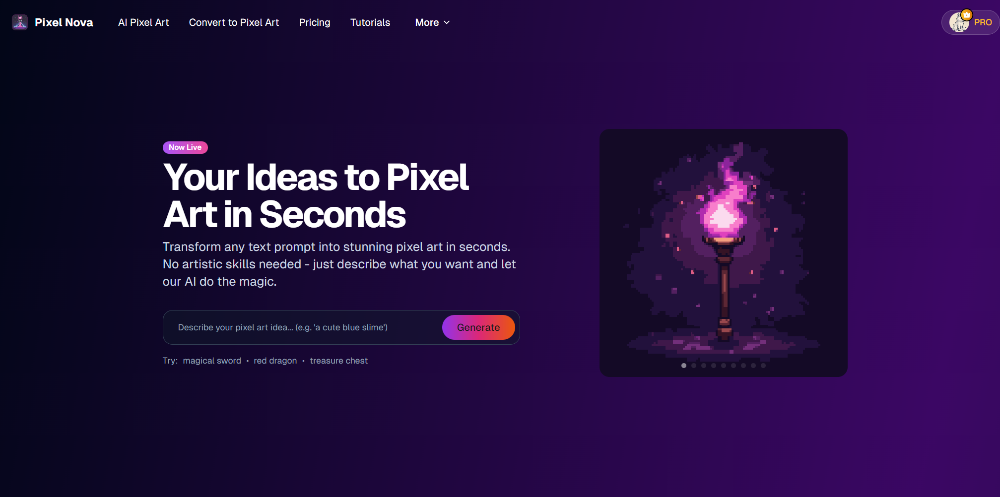
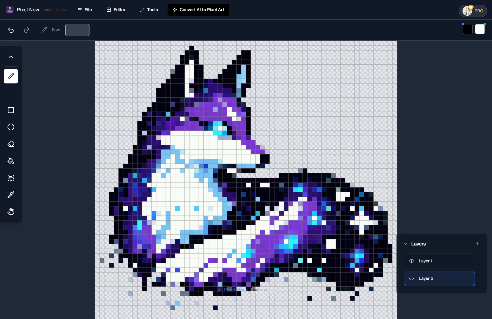
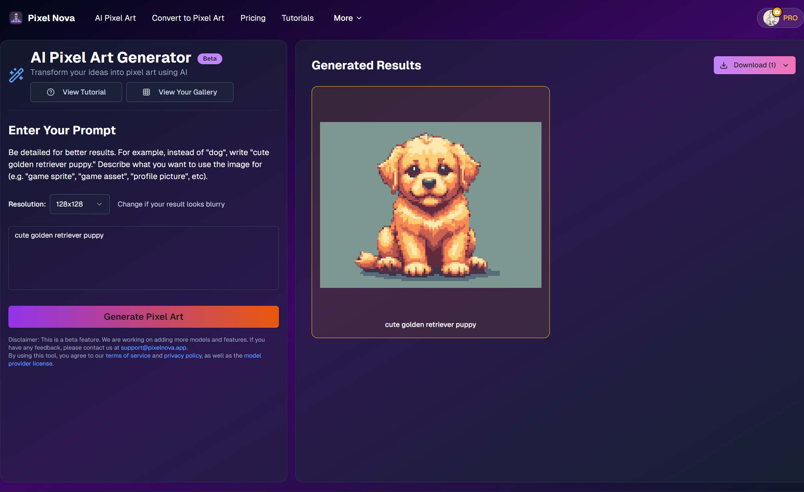
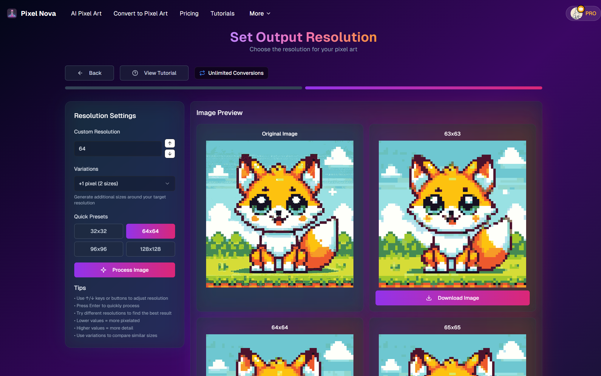
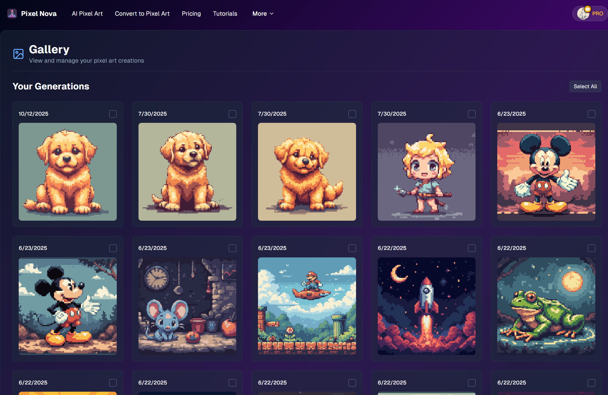

# PixelNova

https://pixelnova.app

PixelNova is a full-stack web-based pixel art editor with AI-powered generation and conversion tools. Built for artists, game developers, and hobbyists, it provides a browser-based environment for creating and manipulating pixel art with professional-grade features including layers, history management, and real-time canvas rendering.

The application includes an integrated pixel art editor with drawing tools, AI-powered image generation, automatic image-to-pixel-art conversion, and a colorization engine. Users can manage projects through a dashboard, browse community galleries, and export work in standard formats. Authentication, credit management, and subscription tiers are handled through Supabase and Stripe.

## Screenshots

### Homepage



### Editor Interface



### AI Generation



### Image Conversion



### See All Your Creations!



## Tech Stack

**Frontend**

- Next.js 14 (App Router)
- React 18 with TypeScript
- Tailwind CSS for styling
- Radix UI / Shadcn UI component library
- Zustand for state management
- Framer Motion for animations
- Stripe for payment integration

**Backend & Services**

- tRPC for type-safe API layer
- Supabase (authentication, database, storage)
- Stripe for payment processing
- Image processing with Pica and Sharp
- express.js

**Deployment**

- Cloudflare Pages
- Fly.io - [View Backend Repository](https://github.com/aydendevnova/pixelnova-backend.git)

## Features

- **Pixel Art Editor**: Drawing tools (pencil, eraser, color picker, selection), multi-layer support, zoom/pan, undo/redo
- **AI Generation**: Text-to-pixel-art and image-to-pixel-art conversion
- **Colorizer**: Automatic color palette generation and application
- **Skin Tone Generator**: Generate skin tone variations for character sprites
- **Gallery System**: Browse and share pixel art creations
- **User Dashboard**: Project management, credit tracking, conversion history
- **Authentication**: Secure user accounts with password reset and session management
- **Credit System**: Usage-based credits for AI features and conversions
- **Subscription Tiers**: Free and premium plans via Stripe

## Setup

```bash
# Install dependencies
npm install

# Configure environment variables from .env.example
# You'll need to setup the backend or use the live link https://pixelnova-backend.fly.dev

# Development
npm run dev

# Build for production
npm run build

# Deploy to Cloudflare Pages
npm run deploy
```

## Project Structure

```
src/
├── app/              # Next.js App Router pages
├── components/       # React components (editor, landing, modals, UI)
├── hooks/            # Custom React hooks (auth, credits, API)
├── lib/              # Utilities, image processing, Supabase client
├── store/            # Zustand stores (editor, history)
└── types/            # TypeScript type definitions
```

## Canvas Implementation

The editor uses HTML5 Canvas with optimized rendering, separate layers for drawing and selection preview, efficient coordinate tracking, and `willReadFrequently` context optimization for pixel-level operations. History management implements undo/redo with state snapshots per drawing operation.

## Previous Implementations

Initially, the project used C++ and WebAssembly (WASM) modules on the frontend to handle complex image processing operations like pixel art conversion and color palette generation. While this provided good performance for individual operations, several challenges emerged:

- The AS/WASM build process added complexity to the fontend
- Bundle sizes increased due to WASM modules
- Memory management between JS and WASM was not simple
- Browser compatibility issues arose with some WASM features

The current implementation moves these computationally intensive tasks to optimized backend services, resulting in:

- Smaller frontend bundle size and simplified codebase
- Better scalability through distributed processing
- Improved reliability and consistent performance
- Easier maintenance and deployment
- Access to more powerful pixel art models and techniques

This architectural shift allows us to leverage specialized machine learning models and image processing libraries on the backend while keeping the frontend focused on providing a smooth, responsive editing experience.
