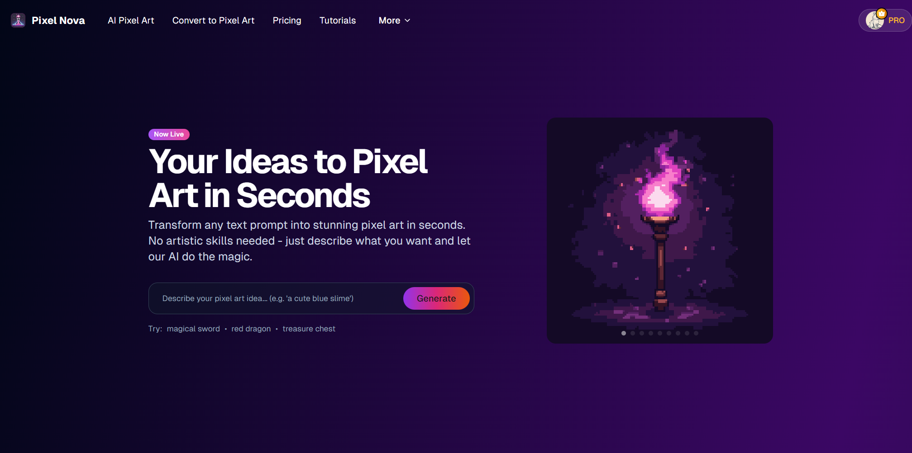
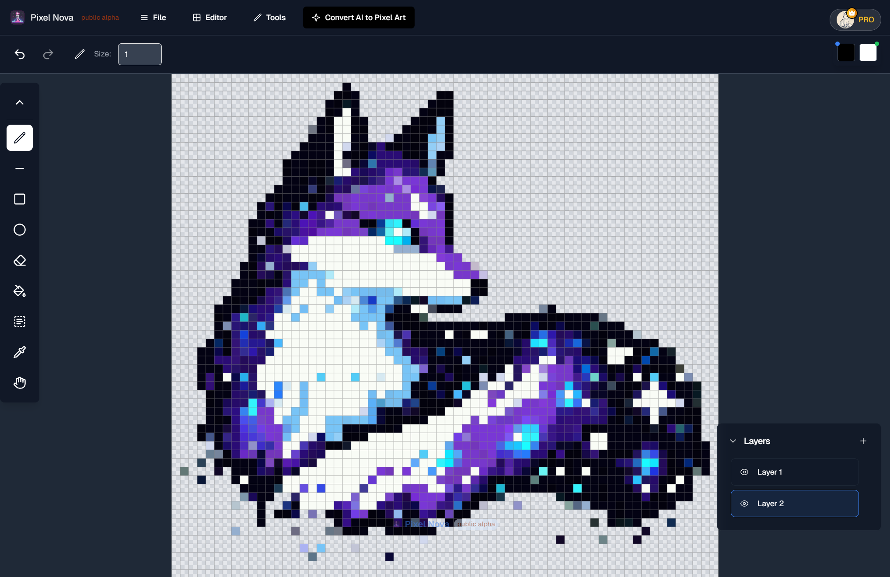
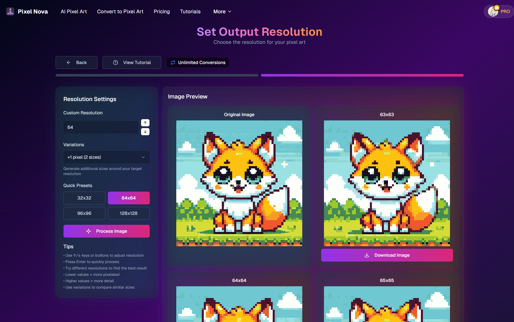

# Pixel Nova Studio

https://pixelnovastudio.app

Pixel Nova Studio is a free, full-stack web-based pixel art toolkit. Built for artists, game developers, and hobbyists, it provides a browser-based environment for creating and manipulating pixel art with professional-grade features including layers, history management, and real-time canvas rendering.

The application includes an integrated pixel art editor with drawing tools, automatic image-to-pixel-art conversion, a colorization engine, and a skin tone palette generator. Every feature is free — there are no plans, credits, or paid tiers. Authentication is handled through Supabase.

## Screenshots

### Homepage



### Editor Interface



### Image Conversion



## Tech Stack

**Frontend**

- Next.js 14 (App Router)
- React 18 with TypeScript
- Tailwind CSS for styling
- Radix UI / Shadcn UI component library
- Zustand for state management
- Framer Motion for animations

**Backend & Services**

- Supabase (authentication, database, storage)
- Image processing with Pica and Sharp
- express.js

**Deployment**

- Cloudflare Pages
- Fly.io - [View Backend Repository](https://github.com/aydendevnova/pixelnova-backend.git)

## Features

- **Pixel Art Editor**: Drawing tools (pencil, eraser, color picker, selection), multi-layer support, zoom/pan, undo/redo
- **Image Converter**: Turn any image into true, pixel-perfect pixel art
- **Colorizer**: Automatic color palette generation and application
- **Skin Tone Generator**: Generate skin tone variations for character sprites
- **User Dashboard**: Quick access to every tool
- **Authentication**: Secure user accounts with password reset and session management
- **Free for everyone**: No plans, credits, or usage limits

## Setup

```bash
# Install dependencies
npm install

# Configure environment variables from .env.example
# You'll need to setup the backend or use the live link https://pixelnova-backend.fly.dev

# Development
npm run dev

# Build for production
npm run build

# Deploy to Cloudflare Pages
npm run deploy
```

## Project Structure

```
src/
├── app/              # Next.js App Router pages
├── components/       # React components (editor, landing, modals, UI)
├── hooks/            # Custom React hooks (auth, API)
├── lib/              # Utilities, image processing, Supabase client
├── store/            # Zustand stores (editor, history)
└── types/            # TypeScript type definitions
```

## Canvas Implementation

The editor uses HTML5 Canvas with optimized rendering, separate layers for drawing and selection preview, efficient coordinate tracking, and `willReadFrequently` context optimization for pixel-level operations. History management implements undo/redo with state snapshots per drawing operation.

## Previous Implementations

Initially, the project used C++ and WebAssembly (WASM) modules on the frontend to handle complex image processing operations like pixel art conversion and color palette generation. While this provided good performance for individual operations, several challenges emerged:

- The AS/WASM build process added complexity to the fontend
- Bundle sizes increased due to WASM modules
- Memory management between JS and WASM was not simple
- Browser compatibility issues arose with some WASM features

The current implementation moves these computationally intensive tasks to optimized backend services, resulting in:

- Smaller frontend bundle size and simplified codebase
- Better scalability through distributed processing
- Improved reliability and consistent performance
- Easier maintenance and deployment

## License

This project is licensed under the [Creative Commons Attribution-NonCommercial-ShareAlike 4.0 International License (CC BY-NC-SA 4.0)](https://creativecommons.org/licenses/by-nc-sa/4.0/).

See the [LICENSE](LICENSE) file for the full text.
